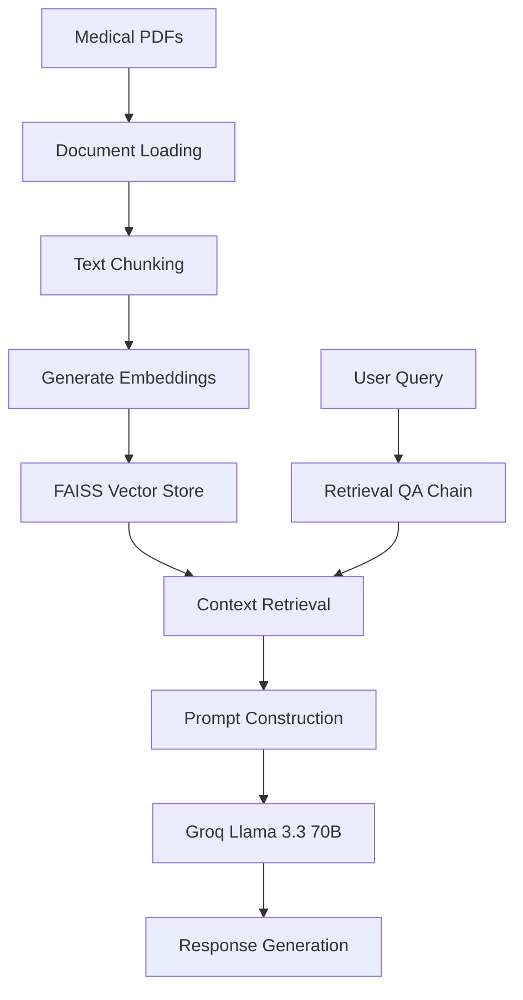
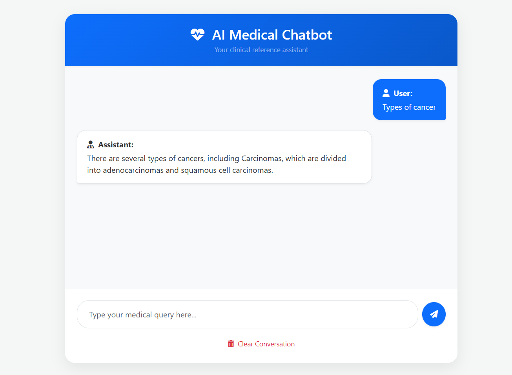

# 🏥 Medical RAG Chatbot: Retrieval-Augmented Generation System

[](https://www.python.org/)
[](https://flask.palletsprojects.com/)
[](https://www.langchain.com/)
[](https://console.groq.com/)
[](https://github.com/facebookresearch/faiss)

An advanced **Retrieval-Augmented Generation (RAG) Chatbot** designed to answer medical questions using information retrieved from custom medical reference documents.

The system combines **HuggingFace Embeddings**, **FAISS Vector Search**, **LangChain RetrievalQA**, and **Groq's Llama-3.3-70B model** to provide accurate, context-aware responses from uploaded medical literature.

---

## ✨ Key Features

* 📚 Medical PDF Knowledge Base
* 🔍 Semantic Search using FAISS
* 🤖 Llama-3.3-70B via Groq API
* 🧠 HuggingFace Embeddings
* ⚡ Fast Retrieval-Augmented Generation
* 🌐 Flask-Based Web Interface
* 🏗️ Modular Production-Ready Architecture
* 📝 Structured Logging & Exception Handling

---

## 📐 System Architecture



---

## 🛠️ Tech Stack

| Component       | Technology              |
| --------------- | ----------------------- |
| Backend         | Flask                   |
| LLM             | Llama-3.3-70B-Versatile |
| LLM Provider    | Groq                    |
| Framework       | LangChain               |
| Embeddings      | all-MiniLM-L6-v2        |
| Vector Database | FAISS                   |
| Language        | Python                  |
| Frontend        | HTML, CSS, JavaScript   |
| Environment     | dotenv                  |

---

## 📁 Project Structure

```text
Medical-RAG-Chatbot/
│
├── app/
│   ├── common/
│   │   ├── custom_exception.py
│   │   └── logger.py
│   │
│   ├── components/
│   │   ├── data_loader.py
│   │   ├── embedding.py
│   │   ├── llm.py
│   │   ├── load_pdf.py
│   │   ├── retriever.py
│   │   └── vector_store.py
│   │
│   ├── config/
│   │   └── config.py
│   │
│   ├── templates/
│   │   └── index.html
│   │
│   └── application.py
│
├── medical/
│   └── ui-demo.png
│
├── data/
├── logs/
├── vectorstore/
│
├── .env.example
├── .gitignore
├── req.txt
├── setup.py
└── README.md
```

---

## 🚀 Installation

### 1. Clone Repository

```bash
git clone https://github.com/your-username/Medical-RAG-Chatbot.git

cd Medical-RAG-Chatbot
```

### 2. Create Virtual Environment

```bash
python -m venv venv
```

### Activate Environment

**Windows**

```bash
venv\Scripts\activate
```

**Linux / macOS**

```bash
source venv/bin/activate
```

---

### 3. Install Dependencies

```bash
pip install -r req.txt
```

Optional:

```bash
pip install -e .
```

---

### 4. Configure Environment Variables

Create a `.env` file:

```env
GROQ_API_KEY=your_groq_api_key
```

Get your API key from:

https://console.groq.com

---

### 5. Build Vector Database

Place your medical PDFs inside:

```text
data/
```

Then run:

```bash
python app/components/data_loader.py
```

This creates the FAISS vector index inside:

```text
vectorstore/
```

---

### 6. Run Application

```bash
python app/application.py
```

Open:

```text
http://localhost:5000
```

---

## 💡 Engineering Highlights

### Decoupled Architecture

The application follows a modular design where:

* Document loading
* Embedding generation
* Vector indexing
* Retrieval logic
* LLM inference
* User interface

are implemented independently.

### Efficient Semantic Retrieval

Uses:

```text
sentence-transformers/all-MiniLM-L6-v2
```

to generate dense vector embeddings for semantic similarity search.

### Fast Context Search

FAISS enables high-performance nearest-neighbor retrieval without requiring cloud vector databases.

### Secure Credential Management

API keys are stored in environment variables and never hardcoded.

### Robust Error Handling

Custom exception handlers provide:

* File names
* Line numbers
* Stack traces

for easier debugging.

---

## 📱 User Interface Preview



---

## 🔮 Future Improvements

* Multi-document retrieval
* Chat history memory
* PDF upload from UI
* Medical citation generation
* Source highlighting
* Docker deployment
* Cloud deployment on AWS / Azure

---

## 👨‍💻 Author

**Dibyajyoti Mahapatra(KingLiku)**

Computer Science Engineering Student

Passionate about:

* Artificial Intelligence
* Machine Learning
* Retrieval-Augmented Generation (RAG)
* Backend Development
* NLP Systems

---

⭐ If you found this project useful, consider giving it a star.
